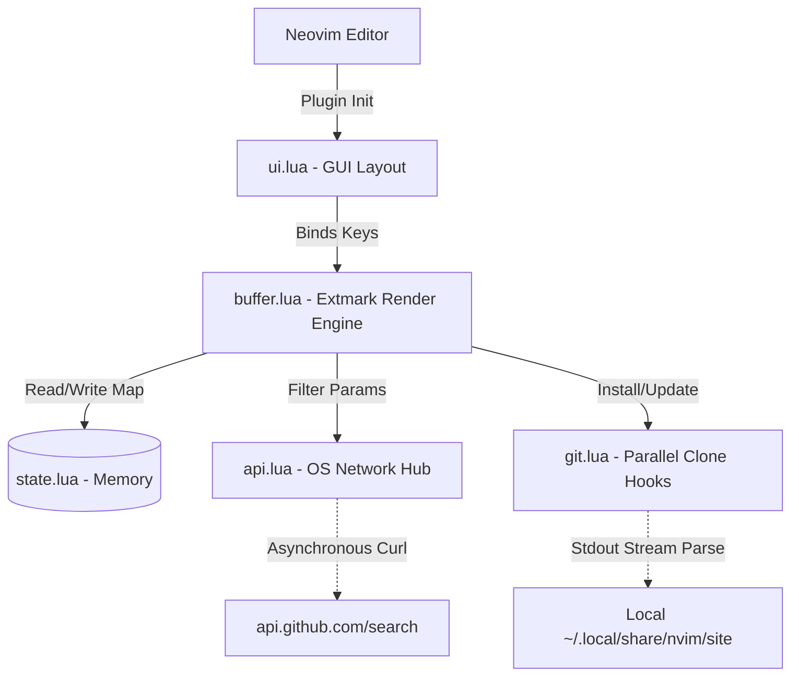

# System Architecture

## Architecture Diagram

## Explanation of Architecture
The plugin follows a sophisticated Model-View-Controller (MVC) design pattern customized for synchronous memory constraints. Because terminal interfaces are sensitive to latency, the architecture leverages Neovim's `vim.schedule()` loops to defer thread-blocking calculations entirely away from the active typing layout layer.

## Modules Description

### 1. The Model Layer (`state.lua`)
Acts as the central nervous system tracking absolute truths. It avoids expensive I/O read operations by managing arrays containing `installed` hashes, `recommended` cache, and boolean states tracking if the system is currently pulling active network requests mode (`search_mode`).

### 2. The Controller / Network Layer (`api.lua` & `git.lua`)
Interacts with external APIs and system binaries. 
- `api.lua` invokes non-blocking `curl` subprocesses hitting `api.github.com`, converting returned Byte streams into deserialized native Lua Data Tables using `pcall(vim.fn.json_decode)`. 
- `git.lua` handles native subprocess cloning and parses standard-error formatting (`stderr`) matching percentage chunks linearly for UI progression interfaces.

### 3. The View Layer (`ui.lua` & `buffer.lua`)
`ui.lua` establishes the windowing configurations—dictating absolute boundaries, borders, and modal creation natively bypassing text splits. `buffer.lua` aggressively destroys and redraws the literal character spacing 60 times a second whenever an interaction is fired, recalculating prefix cursors and tracking active `MarketplaceSelected` highlights autonomously.
